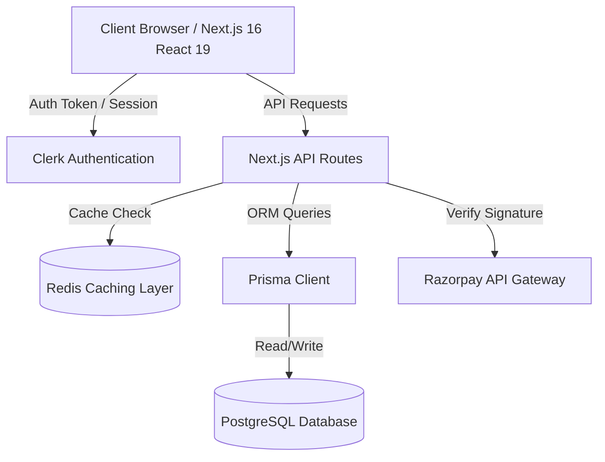
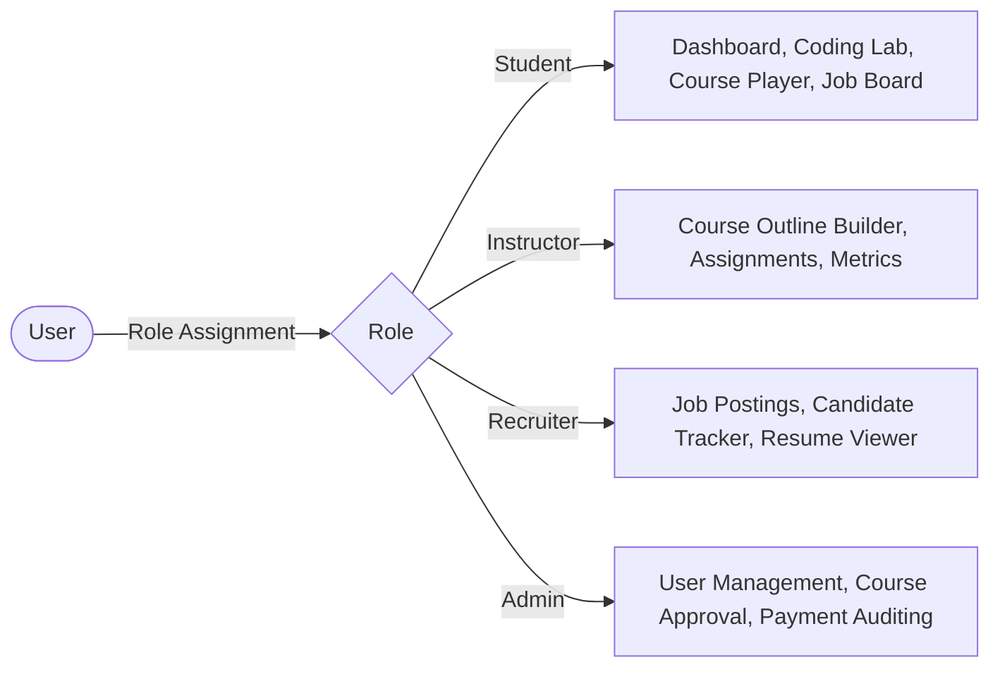
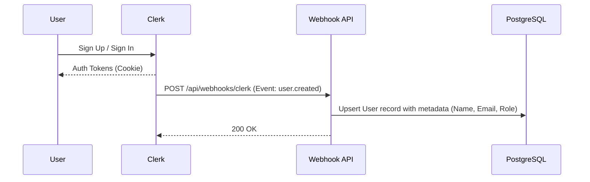
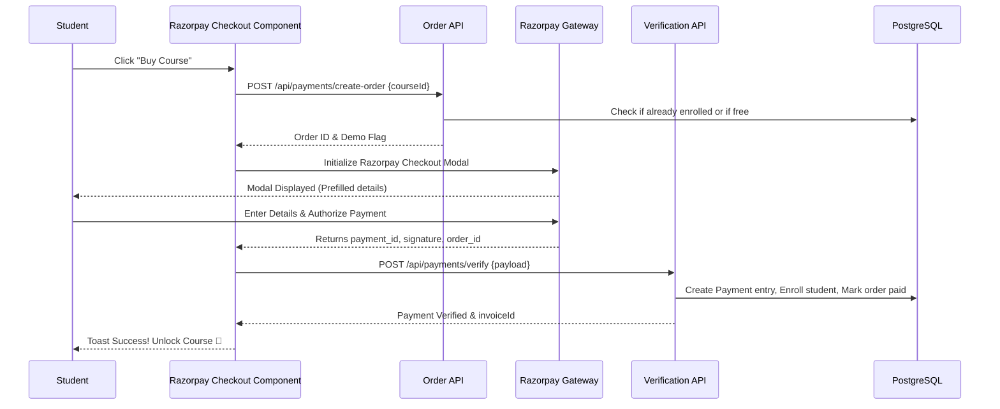
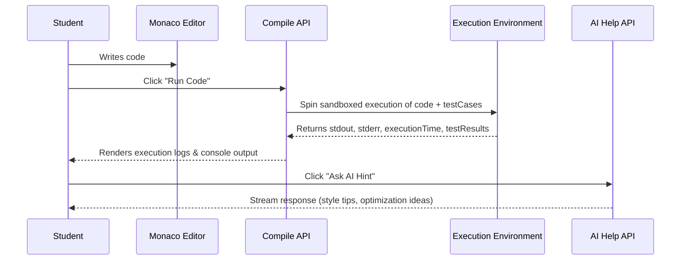

# Skilotech / Skillzy - Project Overview, User Flows, & UI Design

Skillzy (Skilotech) is a premium, state-of-the-art, full-stack Interactive Learning Management System (LMS) and Coding Education Platform built with Next.js 16 and React 19. It combines rich video and text-based courses, an interactive Monaco-powered browser coding environment, local Razorpay payment processing, and job recruitment features in a unified dashboard.

---

## 1. System Architecture

The platform is designed with a high-performance modern web stack featuring real-time caching, asynchronous database operations, and secure, webhook-synchronized authentication.

### Core Technologies
*   **Frontend**: Next.js 16 (App Router), React 19, Monaco Editor, GSAP (GreenSock) for high-performance animations, Framer Motion for dashboard state transitions.
*   **Database**: PostgreSQL & Prisma ORM for type-safe schema modeling.
*   **Caching**: Redis for lightning-fast course catalog queries, with cache invalidation on curriculum changes.
*   **Payments**: Razorpay SDK for secure local payment checkout (INR currency).
*   **Authentication**: Clerk for enterprise-grade authentication with custom webhooks syncing Clerk metadata to the PostgreSQL database.

---

## 2. User Roles & Permission Levels

The application features four distinct user roles, each accessing a tailored layout and set of features:

1.  **Student (Learner)**
    *   *Permissions*: View public courses, purchase courses, read course curriculum, execute coding challenges in the Coding Lab, request AI hints, apply to jobs.
2.  **Instructor (Educator)**
    *   *Permissions*: View author dashboard, create courses/modules/lessons, edit curriculum (using visual builders), review student assignments.
3.  **Recruiter (Hiring Partner)**
    *   *Permissions*: View hiring dashboard, post job listings, filter applicants, update status (Shortlisted, Rejected, Hired), add recruiter notes.
4.  **Admin (Platform Operations)**
    *   *Permissions*: View system metrics, manage user roles, approve/reject pending courses, audit financial transactions (payments).

---

## 3. Core Application Flows

### A. Authentication & User Sync Flow
When a user signs up or logs in through Clerk, a webhook triggers a backend function to sync user profiles to the database.

### B. Course Purchase Flow (Razorpay Integration)
To unlock premium courses, students complete checkout through Razorpay. A verification API guarantees signature validity.

### C. Coding Lab Execution Flow
Students write code in JavaScript, Python, C++, or Java inside the Monaco Editor. The code compiles and validates against pre-seeded test cases.

---

## 4. UI Design & Aesthetics

The UI design system prioritizes a premium, high-contrast, modern aesthetic tailored for developers and technical learners.

### A. Color Palette (Dark Theme Focus)
*   **Primary Background**: `#05070f` (Sleek deep navy-black).
*   **Secondary Background**: `#0b0e1a` (Slightly lighter dark blue for cards, navigation panels).
*   **Primary Accent**: `#6366f1` / `rgb(99, 102, 241)` (Indigo purple for buttons, focus rings, interactive states).
*   **Secondary Accent**: `#a78bfa` (Muted lavender for active tabs, status indicators).
*   **Success state**: `#10b981` (Emerald green).
*   **Warning state**: `#f59e0b` (Amber yellow).
*   **Text Primary**: `#f8fafc` (Slate-50 for high readability).
*   **Text Secondary**: `#94a3b8` (Slate-400 for subtext).

### B. Typography
*   **Headers & Logo**: *Outfit* / *Syne* (Clean geometric sans-serif for modern tech vibes).
*   **Body & Dashboard**: *Inter* (Highly legible, neutral sans-serif).
*   **Code Elements**: *Fira Code* / *JetBrains Mono* (Monospace for terminal and Monaco Editor panels).

### C. Visual Elements & Layout
*   **Glassmorphism**: Border borders are colored using semi-transparent gradients (`rgba(255, 255, 255, 0.05)`). Cards feature a slight backdrop filter blur to give depth over radial background glows.
*   **Ambient Glows**: Subtle radial gradients blur behind layout containers to create a premium, alive look.
*   **Micro-animations**:
    *   Hovering over buttons scales them slightly (`scale: 1.02`) and brightens the background gradient.
    *   Active items in the sidebar have a glowing background badge and slide in dynamically.
    *   The Coding Lab features resizable panels with responsive resize handles that update widths in real time.
